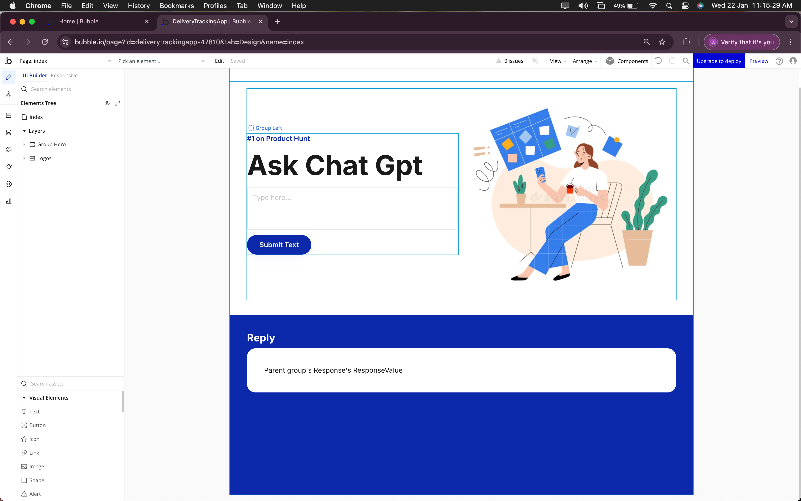

# README: Creating a Bubble Application to Extract and Store JSON Data

This guide provides step-by-step instructions to build a simple Bubble.io application that takes user input, sends it to an API, receives a JSON response, extracts values using regex, and stores them in the database.

---

## Prerequisites
- A Bubble.io account
- Basic understanding of workflows and data types in Bubble
- An API key for the GPT service (if required for testing)

---

## Step 1: Create a Basic Frontend

1. **Open Bubble Editor:**
   - Navigate to your Bubble.io dashboard and create a new application.

2. **Design the UI:**
   - Add an **Input Field** to accept user input.
   - Add a **Button** labeled "Submit" to trigger the workflow.
   - Add a **Text Element** to display results (optional).

**Example Layout:**



---

## Step 2: Setup a Workflow on Button Click

1. Go to the **"Workflow"** tab.
2. Create a new event: **"When Button Submit is clicked"**.
3. Add an action: **"Plugins -> API Connector"** to send input data to GPT.


---

## Step 3: Get Input Value and Send to API

1. Configure the API request:
   - Set the API method to **POST**.
   - Pass the input field value dynamically.
   - Capture the JSON response.

2. Test the API connection to ensure a valid response.

---

## Step 4: Get and Store the Response in Database

1. Go to **"Data" > "Data Types"**.
2. Create a new data type, e.g., `APIResponse`.
3. Add fields such as `response_text` to store the entire JSON response.
4. In the workflow:
   - Add an action: **"Create a new thing"**.
   - Choose the `APIResponse` data type.
   - Store the API response in a field.


---

## Step 5: Extract JSON Values Using Regex

1. Go to **"Data" > "Data Types"**, create separate data types for extracted values (e.g., `Name`, `Age`, etc.).
2. Use the **"Extract with Regex"** action in workflows:
   - Example Regex pattern for extracting a name:
     ```regex
     "name":\s*"([^"]+)"
     ```
   - Store each extracted value in its corresponding data type.

**Workflow Example:**
1. Add an action: **"Set State"** to extract values.
2. Use **"Regex"** operator to parse JSON fields.
3. Store the values separately in the Bubble database.

Example:
- `Name` field: `Extract with Regex -> "name":\s*"([^"]+)"`
- `Age` field: `Extract with Regex -> "age":\s*(\d+)`


---

## Step 6: Storing Extracted Values in the Database

1. Create workflows to save extracted values:
   - **"Create a new thing"** action.
   - Store extracted values into respective fields in the database.

2. Ensure proper database structure with meaningful field names.

---

## Step 7: Testing and Debugging

1. Run the app and submit sample inputs.
2. Check Bubble logs for debugging extraction.
3. Verify stored data in the database.


---

## Conclusion
You have now successfully created a Bubble application that:
- Accepts user input.
- Sends data to an API and retrieves JSON response.
- Extracts JSON values using regex.
- Stores extracted values in the Bubble database.

Feel free to customize the UI and workflows based on your specific needs.

---

## Future Enhancements
- Add error handling for API failures.
- Improve UI with validation and loading indicators.
- Automate workflows for scheduled processing.

---


